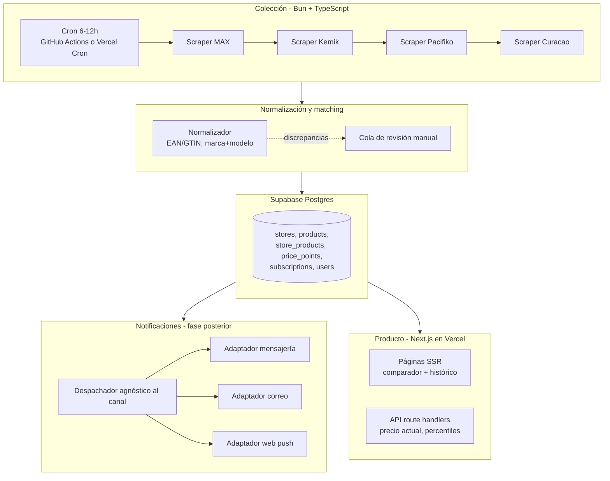

# Arquitectura

> Plataforma de inteligencia de precios ecommerce Guatemala.
> Fuente de verdad del diseño técnico. Contexto de negocio en [../BRAINSTORM.md](../BRAINSTORM.md).

## 1. Principios de diseño

1. **El colector es lo primero y va desacoplado del producto.** El histórico de precios no se puede retro-generar; el dataset crece aunque el frontend no exista.
2. **Simplicidad primero.** Scripts cron secuenciales, sin colas ni workers. La prioridad es tener algo demostrable rápido (hackathon / validación de negocio). La arquitectura event-driven es una ruta de migración documentada, no una meta actual.
3. **Fallo ruidoso.** Un scraper bloqueado (challenge de Cloudflare, cambio de plataforma) debe alertar al operador, nunca fallar en silencio ni insertar datos corruptos.
4. **Cortesía agresiva.** El colector debe ser lo opuesto a un ataque: rate limits bajos, user-agent identificable, respeto a robots.txt (detalle en [SCRAPING.md](SCRAPING.md)).
5. **Los datos son el activo.** Cualquier decisión que arriesgue el dataset histórico o su calidad se descarta.

## 2. Vista general

Pipeline de cinco piezas: **colección → normalización/matching → almacenamiento → notificaciones → producto**.

## 3. Componentes

### 3.1 Colector (scrapers)

- **Stack:** TypeScript + Bun. Un script por tienda con una interfaz común (`scrape(store): PricePoint[]`).
- **Ejecución:** cron cada 6–12 horas. Los 4 scrapers corren **secuencialmente** en un solo job — sin colas (RabbitMQ/BullMQ), sin workers, sin paralelismo. Con ~300 SKUs y 4 tiendas el volumen no lo justifica.
- **Hosting del cron:** GitHub Actions cron (gratis, logs incluidos) o Vercel Cron. GitHub Actions es la opción por defecto: los jobs pueden durar más y los logs quedan versionados junto al código.
- **Salida:** inserta filas crudas en `price_points` vía cliente de Supabase. No transforma más allá de parsear el JSON-LD.
- **Errores:** cualquier scraper que no logre extraer datos (challenge, HTML cambiado, timeout) marca el job como fallido y notifica al operador. Un fallo de una tienda no detiene a las demás.

### 3.2 Normalización y matching

- Corre después de la colección, en el mismo job.
- Resuelve cada captura contra `store_products` (mapeo tienda→catálogo canónico). Capturas sin mapeo van a la **cola de revisión manual** (tabla `match_review_queue`, ver [DATA_MODEL.md](DATA_MODEL.md)).
- Estrategia por capas: EAN/GTIN exacto → normalización marca+modelo → revisión manual. Fuzzy/embeddings solo cuando el volumen manual duela (detalle en [SCRAPING.md](SCRAPING.md)).
- Arranque: catálogo canónico de ~300 SKUs curado a mano.

### 3.3 Almacenamiento

- **Supabase** (Postgres gestionado, free tier) desde el día uno. También aporta auth para la fase de producto.
- Serie de tiempo simple: tabla `price_points` con índice `(store_product_id, captured_at DESC)`. Sin TimescaleDB ni particionado hasta que el volumen lo exija.
- Esquema completo en [DATA_MODEL.md](DATA_MODEL.md).

### 3.4 Notificaciones (documentada, no implementada)

Capa agnóstica al canal, diseñada para no casarse con Telegram/WhatsApp/email:

- `subscriptions`: qué quiere el usuario (producto + precio objetivo).
- `notification_channels`: cómo contactarlo (tipo + dirección: chat id, email, endpoint de web push).
- **Despachador:** job que corre tras cada ingesta, evalúa suscripciones activas contra los nuevos `price_points` y entrega a través de adaptadores por canal (mensajería, correo, notificaciones del navegador).

El modelo de datos se crea desde el inicio para no migrar después; los adaptadores se implementan en una fase posterior.

### 3.5 Producto (web + API)

- **Next.js hosteado en Vercel**, cubriendo ambas capas:
  - **SSR:** páginas de producto (comparador entre tiendas + gráfica de histórico), listados por categoría. SSR ayuda al SEO, que es parte del flywheel B2C.
  - **API routes:** precio actual, serie histórica, y señal "¿es buena oferta?" (percentil del precio actual vs. su histórico).
- Lee de Supabase directamente (cliente server-side). Sin backend separado.
- Fase SaaS B2B: dashboards agregados por categoría/marca/tienda sobre el mismo dataset, detrás de auth de Supabase.

## 4. Flujo de datos por ciclo

1. Cron dispara el job de colección (cada 6–12 h).
2. Cada scraper lee sitemap + JSON-LD de su tienda y produce capturas crudas.
3. El normalizador resuelve capturas contra el catálogo canónico; inserta `price_points`; discrepancias van a la cola de revisión.
4. (Fase posterior) El despachador evalúa suscripciones y notifica por el canal configurado.
5. El producto (Next.js) consulta Supabase en cada request/render.

## 5. Ruta de migración futura (no ahora)

Cuando existan clientes B2B y el volumen crezca (más tiendas, más SKUs, mayor frecuencia):

| Hoy | Futuro | Disparador |
|---|---|---|
| Scripts cron secuenciales | Colas + workers (BullMQ/Redis) | Un ciclo de colección deja de caber en la ventana del cron |
| `price_points` en Postgres plano | Timescale o particionado | Consultas de histórico lentas por volumen |
| Next.js monolítico | API separada + multi-tenancy | Clientes B2B con SLAs y aislamiento |

La clave: el esquema de datos no cambia en la migración — solo la infraestructura de ejecución. Por eso Postgres gestionado desde el día uno.
