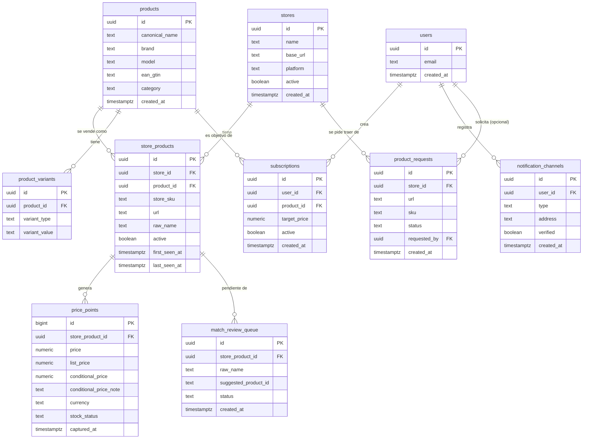

# Modelo de datos

> Esquema mínimo en Supabase (Postgres). El dataset histórico + el catálogo canónico son el activo del proyecto; este esquema está diseñado para sobrevivir la migración futura a event-driven sin rehacer datos.

## 1. Diagrama entidad-relación



## 2. Entidades

### `stores` — tiendas trackeadas

| Columna | Tipo | Notas |
|---|---|---|
| `id` | `uuid` PK | |
| `name` | `text` | MAX, Kemik, Pacifiko, Curacao |
| `base_url` | `text` | ej. `https://www.max.com.gt` |
| `platform` | `text` | Magento, VTEX, custom… (sale del recon técnico) |
| `active` | `boolean` | permite pausar una tienda sin borrar datos |
| `created_at` | `timestamptz` | |

### `products` — catálogo canónico (el moat)

| Columna | Tipo | Notas |
|---|---|---|
| `id` | `uuid` PK | |
| `canonical_name` | `text` | nombre normalizado, ej. "Nintendo Switch 2" |
| `brand` | `text` | |
| `model` | `text` | |
| `ean_gtin` | `text` nullable | clave de matching cuando existe; único si no es null |
| `category` | `text` | consolas, GPUs, celulares… |
| `created_at` | `timestamptz` | |

Arranca con ~300 SKUs curados a mano (nicho tech/gaming).

### `product_variants` — variantes que rompen el matching 1:1

| Columna | Tipo | Notas |
|---|---|---|
| `id` | `uuid` PK | |
| `product_id` | `uuid` FK → products | |
| `variant_type` | `text` | `color`, `storage`, `edition`… |
| `variant_value` | `text` | `256GB`, `OLED`, `blanco`… |

Un `store_product` puede apuntar a un producto base cuya variante exacta se captura aquí. Evita inflar el catálogo canónico con un producto por color.

### `store_products` — mapeo tienda → catálogo canónico

| Columna | Tipo | Notas |
|---|---|---|
| `id` | `uuid` PK | |
| `store_id` | `uuid` FK → stores | |
| `product_id` | `uuid` FK → products, nullable | null = aún sin matchear (está en cola de revisión) |
| `store_sku` | `text` | SKU interno de la tienda |
| `url` | `text` | URL de producto (viene del sitemap) |
| `raw_name` | `text` | nombre tal como lo publica la tienda, ej. "NINTENDO SWITCH 2 NSW2-001" |
| `active` | `boolean` | la tienda dejó de listar el producto |
| `first_seen_at` / `last_seen_at` | `timestamptz` | ciclo de vida del listado |

Único por `(store_id, store_sku)`.

### `price_points` — serie de tiempo (append-only)

| Columna | Tipo | Notas |
|---|---|---|
| `id` | `bigint` PK (identity) | volumen alto, no necesita uuid |
| `store_product_id` | `uuid` FK → store_products | |
| `price` | `numeric(12,2)` | precio de venta real al momento de captura |
| `list_price` | `numeric(12,2)` nullable | precio "de lista" tachado; null si no hay descuento |
| `conditional_price` | `numeric(12,2)` nullable | precio con condición (descuento de banco, cupón) |
| `conditional_price_note` | `text` nullable | ej. "pagando con BAC" |
| `currency` | `text` | `GTQ` por defecto |
| `stock_status` | `text` | ver estados abajo |
| `captured_at` | `timestamptz` | momento de captura |

**Estados de `stock_status`** — sin stock y no capturado son cosas distintas:

- `in_stock` — disponible.
- `out_of_stock` — la tienda lo lista pero sin stock (el precio puede seguir siendo válido como referencia).
- `unknown` — se capturó precio pero la disponibilidad no era legible.

Si un ciclo de scraping **no logra capturar** un producto, **no se inserta fila** — la ausencia de fila en ese ciclo es el estado "no capturado". Nunca inventar un `price_point` para marcar un fallo.

### `users`, `subscriptions`, `notification_channels` — capa de alertas (fase posterior)

| Tabla | Propósito |
|---|---|
| `users` | identidad (email; auth vía Supabase) |
| `subscriptions` | qué quiere: `product_id` + `target_price` + `active` |
| `notification_channels` | cómo contactarlo: `type` (`messaging` / `email` / `web_push`) + `address` (chat id, email, endpoint push) + `verified` |

Separar suscripción de canal permite agregar canales sin tocar las suscripciones. Las tablas se crean desde el inicio; los adaptadores de entrega se implementan después.

### `match_review_queue` — cola de revisión manual

| Columna | Tipo | Notas |
|---|---|---|
| `id` | `uuid` PK | |
| `store_product_id` | `uuid` FK → store_products | |
| `raw_name` | `text` | copia para revisar sin joins |
| `suggested_product_id` | `uuid` nullable | sugerencia del matcher automático si la hubo |
| `status` | `text` | `pending` / `matched` / `new_product` / `ignored` |
| `created_at` | `timestamptz` | |

### `product_requests` — cola on-demand

Lo que un usuario pide traer desde una tienda que la Edge Function `fetch-product` no resolvió en el fetch síncrono (ver [USER_FLOW.md](USER_FLOW.md) y [EDGE_FUNCTIONS.md](EDGE_FUNCTIONS.md)). Una fila = una tienda pendiente de scrapear para un producto/URL/SKU dado.

| Columna | Tipo | Notas |
|---|---|---|
| `id` | `uuid` PK | |
| `store_id` | `uuid` FK → stores, nullable | la tienda a scrapear; nullable si todavía no se resuelve (ej. se encoló por `sku` sin tienda específica) |
| `url` | `text` nullable | URL de producto si se conoce |
| `sku` | `text` nullable | SKU si se conoce en vez de URL |
| `status` | `text` | ciclo de estados, ver abajo |
| `requested_by` | `uuid` FK → users, nullable | `null` cuando la solicitud vino de un usuario anónimo (permitido, con rate limit — ver [USER_FLOW.md](USER_FLOW.md)) |
| `created_at` | `timestamptz` | |

**Ciclo de estados** (convención de aplicación — la migración solo define `status text default 'pending'`; el dev-scraper es responsable de implementar las transiciones):

```
pending → processing → done
                      → failed
```

- `pending`: la Edge Function encoló la fila; el collector todavía no la toma.
- `processing`: el collector la tomó en la corrida actual (evita que dos corridas la procesen a la vez).
- `done`: se insertó el `price_point` correspondiente para esa tienda.
- `failed`: la captura falló (WAF, timeout, markup inesperado); **no** hay `price_point` nuevo — nunca se inventa uno para "cerrar" la fila.

El índice parcial `idx_product_requests_pending` (sección 3) está pensado exactamente para el paso 1 del collector: encontrar rápido las filas en `pending` sin escanear toda la tabla.

## 3. Índices clave

```sql
-- La consulta dominante: histórico de un producto en una tienda
CREATE INDEX idx_price_points_series
  ON price_points (store_product_id, captured_at DESC);

-- Matching por EAN
CREATE UNIQUE INDEX idx_products_ean ON products (ean_gtin) WHERE ean_gtin IS NOT NULL;

-- Lookup de scraper: ¿ya conozco este SKU de esta tienda?
CREATE UNIQUE INDEX idx_store_products_sku ON store_products (store_id, store_sku);

-- Cola de revisión pendiente
CREATE INDEX idx_review_pending ON match_review_queue (status) WHERE status = 'pending';

-- Cola on-demand pendiente: lo que el collector debe tomar en la siguiente corrida
CREATE INDEX idx_product_requests_pending ON product_requests (status) WHERE status = 'pending';
```

## 4. Notas de crecimiento

- **Volumen estimado MVP:** ~300 SKUs × 4 tiendas × 2-4 capturas/día ≈ 2,400–4,800 filas/día en `price_points` (~1.5M filas/año). Postgres plano con el índice de serie lo maneja sin problema.
- **No ahora:** TimescaleDB, particionado por fecha, y agregados materializados quedan como optimización futura; el disparador es que las consultas de histórico se degraden, no una fecha.
- **Append-only:** `price_points` nunca se actualiza ni borra. Correcciones de matching se hacen re-apuntando `store_products.product_id`, no tocando la serie.
