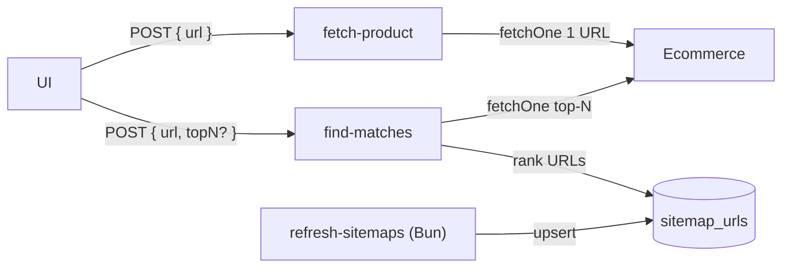

# Edge Functions de Supabase para el scraper (on-demand)

> Flujo on-demand disparado por la UI. Complementa [ARCHITECTURE.md](ARCHITECTURE.md) y [SCRAPING.md](SCRAPING.md). Diseño: [plans/2026-07-16-edge-on-demand-design.md](plans/2026-07-16-edge-on-demand-design.md).

## Por qué

El colector recurrente construye el histórico. La UI necesita, además:

1. **Info inmediata** de una URL de producto (`fetch-product`).
2. **Candidatos en otras tiendas** del mismo producto (`find-matches`).

Ambas son Edge Functions síncronas (Deno), consumibles con `fetch` + anon key.

## Flujo



`find-matches` **no** baja sitemaps en el request (timeout + cortesía). El cache lo llena `bun run refresh-sitemaps`.

## Contrato JSON

Ambas: `POST`, `Content-Type: application/json`, CORS habilitado. Shape de producto compartido:

```json
{
  "store": "pacifiko",
  "url": "https://...",
  "rawName": "...",
  "price": 4999,
  "listPrice": null,
  "currency": "GTQ",
  "stockStatus": "in_stock",
  "storeSku": "230949",
  "eanGtin": null,
  "capturedAt": "2026-07-16T23:23:50.227Z"
}
```

### `fetch-product`

**Request:** `{ "url": "https://..." }`

**200:** el shape de producto arriba.

**Errores:** `400` URL/tienda inválida · `404` sin datos de producto · `502` bloqueo/markup inesperado.

### `find-matches`

**Request:** `{ "url": "https://...", "topN": 3 }` — `topN` opcional (default 3, máx 5).

**200:**
```json
{
  "source": { /* ProductDto */ },
  "matches": {
    "kemik": [
      {
        "url": "https://...",
        "score": 0.91,
        "confident": true,
        "eanMatch": false,
        "product": { /* ProductDto */ }
      }
    ],
    "pacifiko": [],
    "curacao": []
  }
}
```

- `confident`: `score >= 0.85` o `eanMatch`.
- Array vacío = sin candidatos sobre el umbral mínimo (no inventar matches).
- Cache vacío/stale (>7 días): `503` `{ "error": "sitemap_cache_stale", "stores": ["pacifiko"] }`.

## Cache `sitemap_urls`

| Columna | Tipo | Notas |
|---|---|---|
| `store_key` | text | `max` / `kemik` / `pacifiko` / `curacao` |
| `url` | text | URL de producto |
| `refreshed_at` | timestamptz | mismo timestamp por corrida |
| PK | `(store_key, url)` | |

RLS on, sin policies para `anon`/`authenticated` — solo service role (Edge Functions + script).

```sh
bun run refresh-sitemaps   # cortesía 2–5 s; escribe el cache
```

## Runtime

- Deno en Edge Functions; import de `@pgt/core` / `@pgt/scrapers` por import map → rutas relativas al monorepo.
- Fetch cortés: mismo UA + delay que scrapers. Ante challenge WAF: fallar ruidosamente, nunca evadir.
- MVP: **no** escriben `price_points` / subscriptions. Solo responden JSON a la UI.

## Cómo correr

```sh
bun run db:start && bun run db:reset   # aplica migraciones
bun run refresh-sitemaps               # llena cache (lento la 1ª vez)
bun run fn:serve                       # sirve todas las functions local
```

```sh
curl -s http://127.0.0.1:54321/functions/v1/fetch-product \
  -H "Authorization: Bearer $SUPABASE_ANON_KEY" \
  -H "Content-Type: application/json" \
  -d '{"url":"https://www.max.com.gt/..."}'
```

## Estado

Implementación en curso (2026-07-16): tabla + refresh + dos functions según este contrato.
