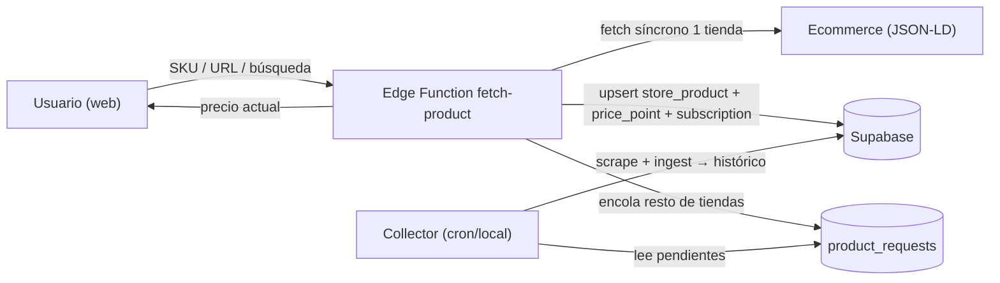

# Edge Functions de Supabase para el scraper (on-demand)

> Documentación a grandes rasgos del uso de Supabase Edge Functions para el flujo on-demand disparado por el usuario. Complementa [ARCHITECTURE.md](ARCHITECTURE.md) y [SCRAPING.md](SCRAPING.md). Template en `supabase/functions/fetch-product/`.

## Por qué

El colector recurrente (cron/local) construye el histórico. Pero además queremos que un usuario **busque o ingrese un SKU/URL** y obtenga el **precio actual al instante** + empiece a trackearlo. Ese flujo interactivo vive en una **Supabase Edge Function** (`fetch-product`): serverless, pegada a la DB y a la auth de Supabase, invocable directo desde el web client.

## Flujo



1. El usuario envía `{ url | sku, storeName }` (con auth de Supabase).
2. La function hace un **fetch síncrono de una** tienda/URL, parsea el JSON-LD y obtiene el precio actual.
3. Hace `upsert` de `store_products`, inserta el primer `price_point` y crea la `subscription`.
4. **Encola** el resto de tiendas en `product_requests` (status `pending`) para que el collector complete el matching y siga el tracking.
5. Responde el precio actual de inmediato.

## Puntos clave

- **Runtime Deno, no Bun.** Las Edge Functions corren en Deno. Por eso la lógica de fetch/parseo se mantiene **runtime-agnóstica** en `@pgt/core` (`fetch` estándar, sin `Bun.*`) y se importa por ruta relativa (`../../../packages/core/src/parsing.ts`). supabase-js se importa vía `jsr:@supabase/supabase-js@2`.
- **El histórico no se retro-genera.** Para un SKU nuevo el histórico arranca desde ahora; para productos ya en el dataset se muestra el histórico existente. La UX debe dejarlo claro.
- **Cortesía / anti-bot.** Un fetch on-demand de **un** producto es 1 request → aceptable. NO permitir que el usuario dispare un crawl síncrono de las 4 tiendas (lento + riesgo de challenge de Cloudflare); por eso el resto se **encola**.
- **Fallar ruidosamente.** Ante challenge o markup inesperado, responder error y nunca insertar datos corruptos ni intentar evadir el WAF.

## Cómo correr / desplegar

```sh
bun run fn:serve    # local: supabase functions serve fetch-product --no-verify-jwt
bun run fn:deploy   # deploy a Supabase
```

## Estado

Template con `TODO(dev-edge)`: falta resolver la tienda, el fetch cortés real, el `upsert` + `insert` + `subscription` y el encolado en `product_requests`.
