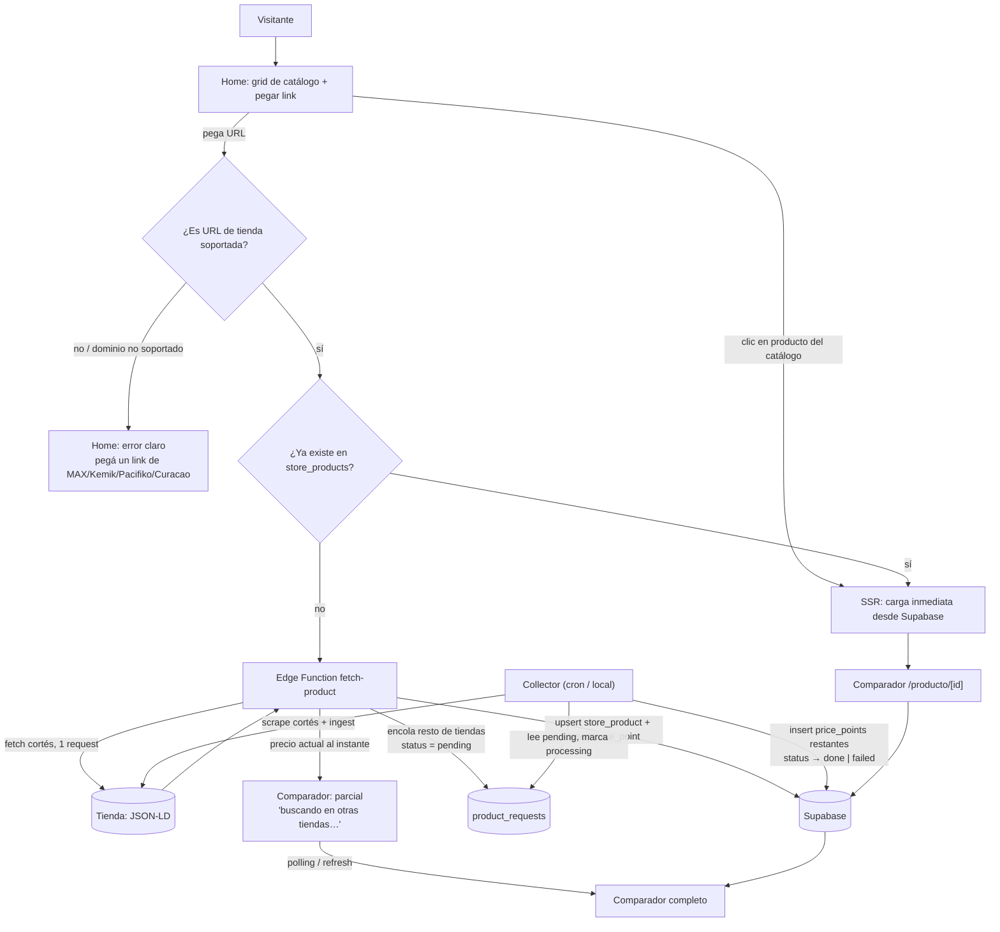
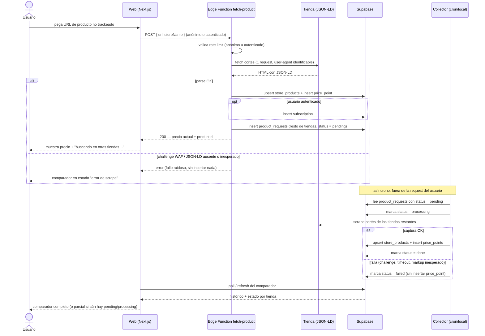

# Flujo de usuario

> Contrato entre la UI (`apps/web`) y el colector/edge function (dev-scraper). Complementa [ARCHITECTURE.md](ARCHITECTURE.md) (componentes), [EDGE_FUNCTIONS.md](EDGE_FUNCTIONS.md) (detalle de la Edge Function) y [DATA_MODEL.md](DATA_MODEL.md) (esquema, incluyendo `product_requests`).

## 1. Los tres caminos

Un visitante llega a `apps/web` y puede terminar en uno de estos caminos:

1. **Navegar el catálogo trackeado** (camino rápido): el visitante recorre el grid de productos del home (todos o filtrados por categoría) y entra a uno ya existente en el catálogo canónico → carga inmediata desde Supabase vía SSR, sin tocar ninguna tienda en vivo. **No hay búsqueda de texto**: el home no tiene un campo de búsqueda por nombre/marca/modelo.
2. **Pegar un link de una tienda soportada** (camino on-demand): el visitante pega una URL de MAX/Kemik/Pacifiko/Curacao en el único campo del home. Primero se resuelve del lado del servidor si esa URL ya existe en `store_products` (sin tocar la tienda en vivo); si no, la Edge Function `fetch-product` trae el precio de **esa** tienda al instante y encola el resto.
3. **Vista comparador** (`/producto/[id]`): destino final de ambos caminos anteriores. Muestra precio y variantes ligeras en cada tienda soportada, gráfica de histórico y la señal "¿es buena oferta?".

Estos tres caminos son responsabilidad de la UI (otro agente los está construyendo en paralelo, ver sección 5); este documento es el contrato para que la UI y el dev-scraper (colector + Edge Function) coincidan en comportamiento y estados.

## 2. Diagrama de flujo



## 3. Secuencia del camino on-demand



## 4. Contrato para dev-scraper

### 4.1 Edge Function `fetch-product` (camino síncrono)

Debe implementar, en este orden:

1. **Resolver la tienda** desde la URL recibida (dominio → `stores.id`); rechazar URLs de tiendas no soportadas.
2. **Fetch cortés de 1 sola request** a esa URL (user-agent identificable, sin reintentos agresivos) — nunca más de una tienda por invocación.
3. **Parsear JSON-LD** (`schema.org/Product`) con `parseProductFromHtml` de `@guateofertas/core`.
4. **Upsert** de `store_products` (por `(store_id, store_sku)` o por URL si el SKU no está disponible aún) + **insert** de un `price_point` con el precio capturado.
5. Si hay usuario autenticado, **insert** de `subscription` (producto + sin precio objetivo por default, o el que envíe el usuario).
6. **Encolar** el resto de tiendas soportadas en `product_requests` (una fila por tienda restante, `status = 'pending'`, `requested_by` = usuario si está autenticado, `null` si es anónimo).
7. **Responder** el precio actual capturado en el paso 3–4 (no esperar a las tiendas encoladas).

Aplica el **rate limit de anónimos** (sección 6) antes del paso 2 — un request bloqueado por rate limit no debe llegar a tocar la tienda.

### 4.2 Collector — consumo de `product_requests`

El collector (cron/local, ver [ARCHITECTURE.md](ARCHITECTURE.md)) además de su ciclo recurrente normal, en cada corrida:

1. Lee filas de `product_requests` con `status = 'pending'`.
2. Marca cada una como `status = 'processing'` antes de scrapear (evita que dos corridas la tomen a la vez).
3. Resuelve `store_id` (si venía nulo, por `sku`/`url`) y hace el mismo fetch cortés + parse que el ciclo normal — respeta el mismo rate limit por tienda (1 request cada 2–5 s, ver [SCRAPING.md](SCRAPING.md)).
4. Si la captura tiene éxito: upsert de `store_products`, insert de `price_point`, marca `status = 'done'`.
5. Si falla (challenge, timeout, markup inesperado): marca `status = 'failed'` **sin insertar ningún `price_point`** — nunca inventar un dato para "cerrar" la fila.

### 4.3 Ciclo de estados de `product_requests`

```
pending → processing → done
                      → failed
```

- `pending`: encolada por la Edge Function, todavía no la toma el collector.
- `processing`: el collector la está procesando en esta corrida.
- `done`: se insertó el `price_point` correspondiente; el producto queda trackeado en esa tienda.
- `failed`: la captura falló (WAF, timeout, markup inesperado); no hay `price_point` nuevo. Queda disponible para reintento manual o en la siguiente corrida (a criterio del dev-scraper: reintentar `failed` automáticamente o dejarlas para revisión).

Ver también [DATA_MODEL.md](DATA_MODEL.md#product_requests--cola-on-demand) para las columnas y el índice parcial de pendientes.

### 4.4 Modos de falla (heredados de las reglas duras del proyecto)

- **Challenge de Cloudflare/WAF** (en el fetch síncrono o en el collector): fallar ruidosamente, responder error a la UI, **nunca** intentar evadir el challenge.
- **Nunca insertar datos corruptos**: si el JSON-LD viene incompleto o con precio inválido (0, negativo, no numérico), descartar la captura completa — no hacer upsert parcial.
- **Nunca inventar `price_point`**: una tienda que falla en el fetch síncrono o en el collector simplemente no genera fila ese ciclo; el estado `failed` en `product_requests` es la señal de fallo, no un `price_point` sintético.

## 5. Estados de UI por pantalla

> La UI vive en `apps/web` (otro agente la implementa en paralelo); esta sección documenta los estados que debe cubrir, no el código.

### Home

| Estado | Cuándo | Qué muestra |
|---|---|---|
| Catálogo | Primera carga / navegación por categoría | Grid de productos trackeados (nombre, mejor precio actual) + campo para pegar link siempre visible |
| Link ya trackeado | El visitante pega una URL que ya existe en `store_products` | Redirección directa a `/producto/[id]`, sin tocar la tienda en vivo |
| Link nuevo soportado | URL de MAX/Kemik/Pacifiko/Curacao sin trackear todavía | Edge Function `fetch-product`: precio de esa tienda al instante + "buscando en otras tiendas…" |
| Link inválido / no soportado | El texto pegado no es una URL, o el dominio no es una tienda soportada | Mensaje explícito: pegá un link de MAX/Kemik/Pacifiko o Curacao (no hay búsqueda por texto) |

### Comparador (`/producto/[id]`)

| Estado | Cuándo | Qué muestra |
|---|---|---|
| Completo | El producto ya tiene `store_products` en las tiendas relevantes con `price_points` | Precio + variantes ligeras por tienda, gráfica de histórico, señal "¿es buena oferta?" |
| Parcial / pendiente | Viene del camino on-demand y todavía hay `product_requests` en `pending`/`processing` para ese producto | Precio de la tienda ya resuelta + placeholder "buscando en otras tiendas…" por cada tienda pendiente; se actualiza con polling o refresh manual, no websockets |
| Error de scrape | La Edge Function falló en el fetch síncrono (WAF, parse) | Mensaje de error explícito, sin datos inventados; opción de reintentar |

**Nota explícita sobre histórico:** para un SKU que entra por el camino on-demand, el histórico **arranca desde el momento de la primera captura** — no se retro-genera. La gráfica de histórico de un producto recién trackeado empieza con un solo punto (o pocos, según cuántas tiendas ya respondieron) y crece con cada ciclo del collector. Esto es consistente con el principio de [ARCHITECTURE.md](ARCHITECTURE.md) de que el histórico no se puede retro-generar.

## 6. Reglas de acceso

- **Anónimos pueden pegar links y disparar el camino on-demand**, sujeto a rate limit (por IP o por sesión, a definir en la implementación de la Edge Function — el requisito es que exista, no un valor específico todavía).
- **Crear una `subscription` requiere login.** Un usuario anónimo puede ver el precio y el comparador parcial/completo, pero no puede suscribirse a alertas de precio sin autenticarse primero con Supabase Auth.
- `product_requests.requested_by` queda `null` cuando la solicitud viene de un usuario anónimo — es una columna nullable justamente para este caso (ver [DATA_MODEL.md](DATA_MODEL.md)).

## 7. Relación con la UI mínima de `apps/web`

Hoy se construye en paralelo una UI mínima en `apps/web`: home con el catálogo trackeado y un único campo para pegar link (sin búsqueda por texto), y comparador en `/producto/[id]`. Este documento es el contrato que esa UI debe cumplir del lado de estados y llamadas a la Edge Function/Supabase; la implementación de la UI en sí no es parte de este documento.
