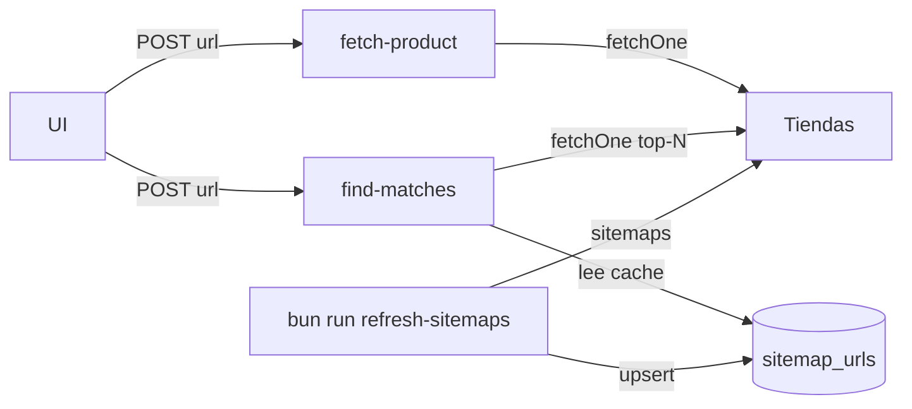

# Edge Functions on-demand + cache de sitemaps

> Diseño validado 2026-07-16. Fuente corta para agentes; detalle de contrato en [../EDGE_FUNCTIONS.md](../EDGE_FUNCTIONS.md).

## Goal

Exponer a la UI dos Edge Functions síncronas:

1. **`fetch-product`** — info de una URL de producto (1 tienda).
2. **`find-matches`** — candidatos del mismo producto en las otras tiendas, con info confirmada.

Para que `find-matches` quepa en timeout, las URLs de producto viven en un **cache Postgres** (`sitemap_urls`), refrescado por un script Bun fuera del request.

## Architecture

- Reutiliza scrapers (`@pgt/scrapers.fetchOne`) y scoring (`@pgt/core` tokenize/scoreTokens).
- **No** persisten `price_points` ni subscriptions en este MVP — solo lectura/respuesta JSON para la UI.
- **No** crawl de sitemaps dentro de la Edge Function. Cache vacío/stale → `503`.

## Constantes

| Constante | Valor |
|---|---|
| Stale cache | 7 días |
| `topN` default / max | 3 / 5 |
| Candidatos a confirmar por tienda | 5 |
| Min slug score | 0.34 |
| Confident | score ≥ 0.85 o EAN match |

## Archivos clave

| Path | Rol |
|---|---|
| `supabase/migrations/*_sitemap_urls.sql` | Tabla + RLS |
| `scripts/refresh-sitemaps.ts` | Llena el cache |
| `supabase/functions/fetch-product/` | Info de 1 URL |
| `supabase/functions/find-matches/` | Matching cross-tienda |
| `supabase/functions/_shared/` | CORS, store key, DTO, scrape ctx |
| `packages/core/src/scoring.ts` | tokenize / scoreTokens / slugFromUrl |
